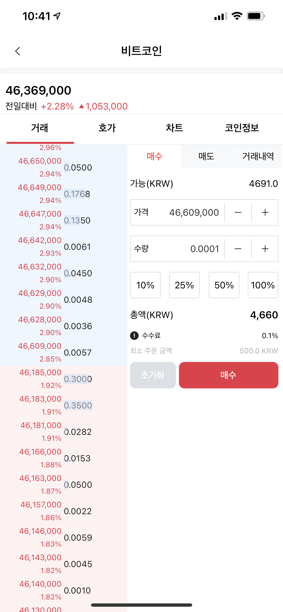
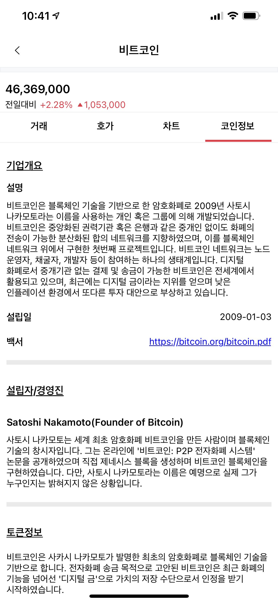
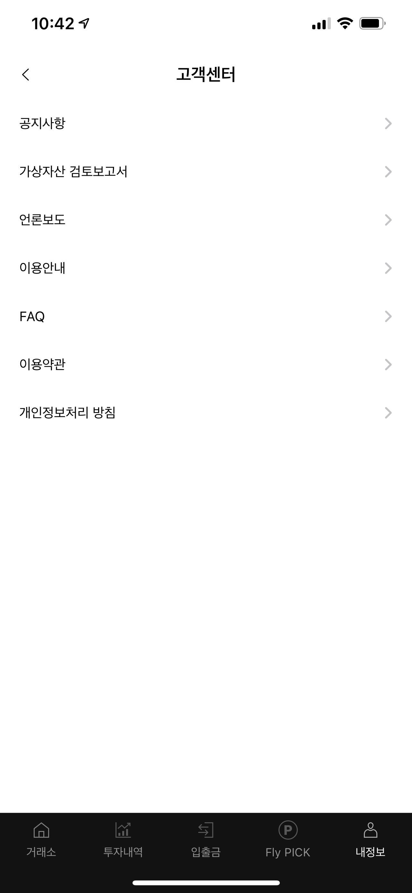

# 이은택

Github : https://github.com/CatMaster-Developer

Mail : letzzang@gmail.com

## 경력

[힛잇 주식회사](https://hitit.xyz/)
- 연구원 - 2021/09 ~ 재직중

[한국디지털거래소](https://flybit.com)
- 차장 - 2021/03 ~ 2021/08(6개월)

[빅솔론](https://bixolon.com/kr/)
- 과장 - 2016/02 ~ 2021.02(5년)

[GNSD]()
- 주임 - 2014/12 ~ 2016/02(1년 3개월)

[큐빅테크]()
- 주임 - 2013/12 ~ 2014/12(1년)

[m3mobile](http://www.m3mobile.co.kr/)
- 연구원 - 2010/03 ~ 2012/08(2년 6개월)

## 회사 프로젝트

### 힛잇 허브 Flutter 앱 신규 개발

- 소속 : 힛잇 주식회사
- 역할 : 힛잇 허브 iPad 앱 신규 개발
- Skill : Dart, Cubit, Clean Architecture, TCP Socket, Unit test
- 개발 기간 : 2023.12.01 ~ 2024.07.01(7월 중 출시 예정)
- 재직 기간 : 2021.09.01 ~ 재직중
- 내용
  - 기 ios전용 어플리케이션의 안드로이드 지원을 위한 flutter 앱 출시

### 힛잇 허브 앱 신규 개발

- 소속 : 힛잇 주식회사
- 역할 : 힛잇 허브 iPad 앱 신규 개발
- Skill : SwiftUI, Combine, Concurrency, Clean Architecture, TCP Socket, Swinject, Unit test
- 개발 기간 : 2022.01.01 ~ 2022.09.20
- 재직 기간 : 2021.09.01 ~ 재직중
- 내용
  - 아이패드 전용 포스 어플리케이션 개발
- Link : https://apps.apple.com/kr/app/hitithub/id1485395039?l=en
- 앱 동작 영상 Link : https://youtu.be/erWdBo8ZUoA
- 앱 동작 영상 Link2 : https://youtu.be/3JvoyJ0Iksw

  

### Flybit

- 소속 : 한국 디지털 거래소
- 역할 : Flybit iOS 앱 신규 개발 및 유지 보수
- Skill : UIKit, RxSwift, git, Realm, firebase, WebSocket, non-storyboard, RxAlamofire
- 개발 기간 : 2021.03.21 ~ 2021.05.25
- 재직 기간 : 2021.03.21 ~ 2021.08.31
- 내용
  - 가상화폐 거래소 앱인 Flybit iOS 앱 신규개발 및 유지보수

- Link : https://apps.apple.com/us/app/flybit/id1570368673

  

### Common Library 개발 < Communicator / Making Data >

- 소속 : 빅솔론
- 역할 : 통신 모듈 / 데이터 생성 모듈 개발
- Skill : Objective-C, iOS, Unit test, git
- 내용
  - 다수의 SDK / APP에서 공통으로 사용하는 기능을 Row 레벨로 개발 
  - 프린터에서 사용하는 커맨드 생성 모듈 개발
  - 프린터와 통신에 필요한 기능 개발 < Bluetooth, Wi-fi, ethernet, BLE >

###  mPrint

- 소속 : 빅솔론
- 역할 : iOS App 개발
- Skill : Swift, Realm, CoreData(old version)  Snapkit, RxSwift, RxCocoa, Action Extension, non-storyboard, Unit test,  git, carthage
- 내용
  - Action Extension 을 제공하여 3rt Party App에서 프린터 인쇄 기능 지원
- AppStore Link (https://apps.apple.com/app/id1439539765)

  

###  mPrint Server

- 소속 : 빅솔론
- 역할 : iOS App 개발
- Skill : Swift, Realm, AutoLayout(Storyboard), Javascript, REST API, Unit test, git, cocoapods
- 내용
  - WebServer를 지원하는 WebApp 개발
  - Sample Web 개발
- AppStore Link (https://apps.apple.com/app/id1472321772)
- Web Sample Link (http://bixolon.com/common/mPrintService/Sample_PosPrinter.html)

  

###  Bixolon Utility

- 소속 : 빅솔론
- 역할 : iOS App 개발
- Skill : Swift, Realm, AutoLayout(Snapkit), Unit test, git, carthage
- 내용
  - 빅솔론 프린터 설정 기능을 지원
- AppStore Link (https://apps.apple.com/app/id1495617320)

  
  

### UPOS SDK(POS 프린터 제어) Refactoring

- 소속 : 빅솔론
- 역할 : iOS SDK 리팩토링, Sample App 개발
- Skill : Objective-C, Swift, iOS, Unit test, git
- 내용 
  - 외부 Header 파일 제외한 내부 코드 재구현
  - MRC -> ARC
  - 누락된 API 구현 및 미지원 API Deprecate
  - 다중 프린터 동시 연결 기능 지원
  - Sample App 구현 ( Obj-C / Swift )
- DownLoad Link (https://www.bixolon.com/_lib/download_single.php?FILE_INFO=sdk|sdk_file|sdk_idx|30|sdk)

### Label SDK(Label 프린터 제어) Refactoring 

- 소속 : 빅솔론
- 역할 : iOS SDK 리팩토링, Sample App 개발
- Skill : Objective-C, Swift, iOS, Unit test, git
- 내용 
  - 외부 Header 파일 제외한 내부 코드 재구현
  - MRC -> ARC
  - 누락된 API 구현 및 미지원 API Deprecate
  - 다중 프린터 동시 연결 기능 지원
  - Sample App 구현 ( Obj-C / Swift )
- DownLoad Link (https://www.bixolon.com/_lib/download_single.php?FILE_INFO=sdk|sdk_file|sdk_idx|29|sdk)

###  ICPAY

- 소속 : 빅솔론
- 역할 : iOS App 개발
- Skill : Swift, Realm, Sqlite,  Snapkit, RxSwift, RxCocoa, non-storyboard, Unit test, carthage, App To App, Codable
- 내용
- 빅솔론 프린터의 카드리더기를 이용해 결제 진행
- AppStore Link (https://apps.apple.com/app/id1139655329)

###  Easy Setup Utility

- 소속 : 빅솔론
- 역할 : iOS App 개발
- Skill : Objective-C, Sqlite, AutoLayout(Storyboard), git
- 내용
  - 빅솔론 프린터 설정 기능을 지원
- AppStore Link (서비스 종료 -> Bixolon Utility 대체)

  

  

###  포드 AVN 개발 

- 소속 : GNSD
- 역할 : Bluetooth / Setting / DVD 모듈 개발
- Skill : Linux, QT
- 개발 기간 : 2015.02.01 ~ 2015.12.31
- 내용
  - Linux 기반의 AVN(audio video navigation) 개발 프로젝트로, phone, Bluetooth / setting / DVD 모듈 개발 및 디바이스 드라이버 개발
    
  
    

###  공정 검사 자동화 프로그램 개발
- 소속 : 큐빅테크
- 역할 : OpenGL 기반의 그래픽스 계산 모듈 개발
- Skill : Windows
- 개발 기간 : 2014.01.01 ~ 2014.10.31
- 내용
  - 자동차 공장에 들어가는 공정 검수 프로그램 개발 프로젝트 중 3차원 그래픽스 계산을 위한 모듈 개발 담당

###  UNI SDK(Scanner, system)

- 소속 : M3Mobile
- 역할 : WinCE Scanner 통합 SDK 개발
- Skill : C, C++, C#, MFC, 
- 내용
  - 기존 모듈 별로 나뉘어 진 Scanner SDK, system SDK를 하나의 SDK로 통합 모듈 개발 및 샘플 어플리케이션 개발
  

###  ril driver, mux driver

- 소속 : M3Mobile
- 역할 : WinCE 기기의 전화 모듈 디바이스 드라이버 개발
- Skill : C
- 내용
  - phone 모듈의 칩셋을 PDA에 붙이는 과정에서 하드웨어 제어 및 어플리케이션과 통신할 수 있는 디바이스 드라이버 개발

  

